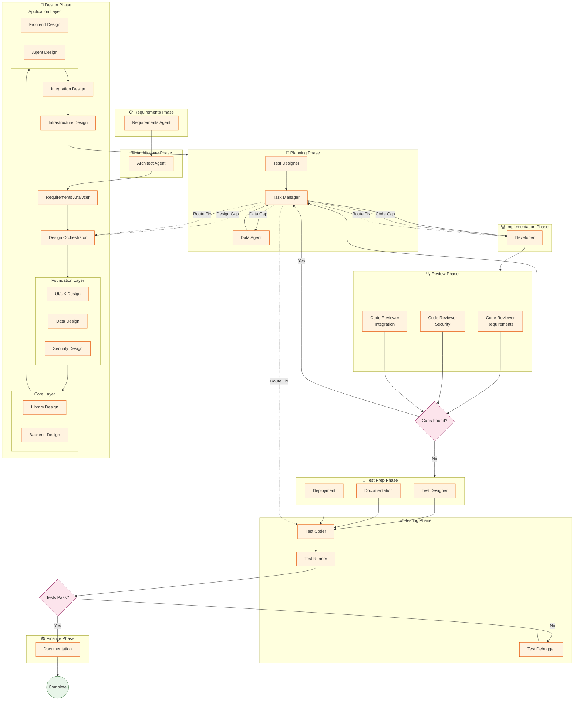

# Claude Code Sub-Agents for Large Projects

A comprehensive framework of specialized sub-agents for Claude Code, designed for the complete software development lifecycle of large-scale applications.

## Overview

This framework provides 25 coordinated AI agents that work together to build your application:

- **Requirements Agent** - Elicits requirements using ISO 29148 standard
- **Architect Agent** - Makes technology and structure decisions
- **Design Orchestrator** - Coordinates 9 specialized design agents
- **Developer Agent** - Writes code following best practices
- **Test Agents** - Plan, write, and run tests
- **Code Review Agents** - Check requirements, security, integration
- **Documentation Agent** - Creates user and developer docs

The **Task Manager** coordinates everything, tracking what's done and what's next.

## Quick Start

### 1. Create Your Project

```bash
gh repo create my-project --template osok/claude-code-startup-large-projects --clone
cd my-project
```

### 2. Initialize

```
initialize
```

### 3. Begin Work

```
lets begin
```

This will:
- Check for existing requirements in `requirement-docs/`
- If none exist, help you create them
- If they exist, ask for your approval
- Once approved, run the full agent workflow

Use `continue` to resume work in new sessions.

## Included Agents (25 total)

### Core Workflow Agents

| Agent | What It Does |
|-------|--------------|
| **Requirements** | Interviews you to understand what to build |
| **Architect** | Makes technology choices, defines structure |
| **Requirements Analyzer** | Parses ISO 29148 requirements structure |
| **Design Orchestrator** | Coordinates specialized design agents |
| **Task Manager** | Coordinates agents, tracks progress |

### Specialized Design Agents

| Agent | Output Prefix | What It Does |
|-------|---------------|--------------|
| **UI/UX Design** | 01-, 90- | UI/UX patterns and style guides |
| **Data Design** | 02- | Data architecture and models |
| **Security Design** | 03- | Security architecture and threat models |
| **Library Design** | 10- | Shared component libraries |
| **Backend Design** | 20- | Backend services and APIs |
| **Frontend Design** | 30- | Frontend applications |
| **Agent Design** | 40- | Background workers and jobs |
| **Integration Design** | 50- | API contracts between systems |
| **Infrastructure Design** | 60- | Cloud, Docker, deployment |

### Implementation Agents

| Agent | What It Does |
|-------|--------------|
| **Data Agent** | Defines schemas and data structures |
| **Deployment** | Docker, env configs, infrastructure |
| **Developer** | Writes application code |
| **Documentation** | Writes user and developer docs |

### Testing Agents

| Agent | What It Does |
|-------|--------------|
| **Test Designer** | Plans what tests are needed |
| **Test Coder** | Writes test code |
| **Test Runner** | Runs tests, reports results |
| **Test Debugger** | Deep debugging across all layers |

### Code Review Agents

| Agent | What It Does |
|-------|--------------|
| **Code Reviewer - Requirements** | Verifies completeness against requirements |
| **Code Reviewer - Security** | Checks OWASP vulnerabilities |
| **Code Reviewer - Integration** | Finds stubs, wiring gaps |

## Language Support

Pre-built conventions for 27 technologies:

**Backend**: Go, Java, Python, TypeScript, Rust, C#/.NET, Ruby, PHP, Kotlin, Scala, Elixir

**Frontend**: React, Vue, Angular, Svelte, Next.js, Nuxt

**Mobile**: Swift, Kotlin Android, Flutter/Dart, React Native

**Infrastructure**: Terraform, Kubernetes, Bash/Shell, SQL

**Emerging**: Zig, Solidity

## Project Structure

```
your-project/
├── .claude/agents/       # Agent definitions
├── CLAUDE.md             # Project memory and status
├── conventions/          # Coding standards by language
├── requirement-docs/     # ISO 29148 requirements
├── design-docs/          # Generated design documents
├── design-templates/     # Design document templates
├── project-docs/         # Task lists, ADRs, schemas
├── developer-docs/       # Docs for contributors
└── user-docs/            # Docs for end users
```

## Commands

| Command | When to Use |
|---------|-------------|
| `initialize` | Reset project to blank state |
| `new work` | Start a new work item - creates requirements doc, interviews you |
| `lets begin` | Check requirements exist, get approval, start workflow |
| `continue` | Resume work in current session |

### `new work` Command

The primary way to start new development:

1. **Creates new sequence** (002, 003, etc.)
2. **Prompts for description** → generates short name
3. **Creates requirements doc**: `requirement-docs/{seq}-requirements-{short_name}.md`
4. **Asks how to provide requirements**:
   - Upload/paste your own requirements
   - Interview mode - agent asks structured questions
5. **Uses ISO/IEC/IEEE 29148:2018** format for requirements

## How It Works

1. **Document-based coordination** - Agents communicate via markdown files
2. **Task Manager as orchestrator** - One agent controls workflow
3. **Schemas as source of truth** - Data Agent maintains authoritative schemas
4. **Smart failure routing** - Test failures route to appropriate agents
5. **Activity logging** - All agent actions logged to `project-docs/activity.log` (JSONL format)

## Document Strategy

**Work-specific documents** (created per work item):
- `requirement-docs/{seq}-requirements-{short_name}.md` - Requirements
- `design-docs/{seq}-design-{short_name}.md` - Design overview

**Foundational documents** (updated, not duplicated):
- `design-docs/01-style-guide.md` - Single style guide
- `design-docs/02-data-architecture.md` - Single data architecture
- `design-docs/03-security-architecture.md` - Single security doc
- Other design docs (10-, 20-, 30-, etc.) - Updated to incorporate new work

When adding new features, design agents **update existing docs** with sections labeled `## Seq {NNN}: {Short Name}` rather than creating duplicates.

## Workflow



### Workflow Phases

| Phase | Agents | Output |
|-------|--------|--------|
| **Requirements** | Requirements | `requirement-docs/` |
| **Architecture** | Architect | `project-docs/adrs/` |
| **Design** | Requirements Analyzer → Design Orchestrator → 9 Specialized Agents | `design-docs/` |
| **Planning** | Test Designer, Data Agent, Task Manager | Test plan, schemas, task list |
| **Implementation** | Developer | Application code |
| **Review** | 3 Code Reviewers (parallel) | Review reports |
| **Test Prep** | Test Designer, Documentation, Deployment | Updated plans, docs, env |
| **Testing** | Test Coder → Test Runner → Test Debugger | Tests, results, fixes |
| **Finalize** | Documentation | Final docs |

## Tips

- Be specific in requirements - more detail = better output
- Answer agent questions thoughtfully
- Review designs before implementation
- Use `continue` to resume sessions

## License

MIT
