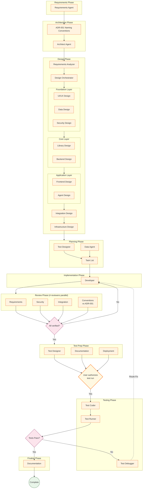

# Claude Code Sub-Agents for Large Projects

A comprehensive framework of specialized sub-agents, slash-command skills, and enforcement hooks for Claude Code, designed for the complete software development lifecycle of large-scale applications.

## Overview

This framework provides **27 coordinated AI agents**, **8 slash-command skills**, and **2 enforcement hooks** that work together to build your application:

- **Requirements Agent** — Elicits requirements using ISO/IEC/IEEE 29148:2018
- **Architect Agent** — Makes technology and structure decisions; produces ADR-001 (naming conventions) before anything else
- **Design Orchestrator** — Coordinates 9 specialized design agents in dependency-ordered waves
- **Developer Agent** — Writes code following project conventions
- **Test Agents** — Plan, write, and run tests (Test Runner fires **only** on explicit user instruction)
- **Code Review Panel** — Four reviewers run in parallel: Requirements, Security, Integration, Conventions
- **Documentation Agent** — Creates user and developer docs

The **parent Claude Code session** performs the orchestrator role, following the authoritative spec in `.claude/agents/task-manager.md`. Subagents can't recursively spawn sub-subagents, so the parent does the orchestration directly to preserve the multi-agent decomposition.

Use `@upgrade` to keep your framework files in sync with the latest version.

## Quick Start

### 1. Create Your Project

```bash
gh repo create my-project --template osok/claude-code-startup-large-projects --clone
cd my-project
```

### 2. Initialize

```
/initialize
```

### 3. Begin Work

```
/lets-begin
```

This will:
- Check for existing requirements in `requirement-docs/`
- If none exist, help you create them
- If they exist, ask for your approval
- Once approved, run the full agent workflow autonomously

Use `/continue` to resume work in new sessions.

## Autonomous Mode

After `/lets-begin` is approved, the orchestrator proceeds autonomously through Architecture, Design, Planning, Implementation, and Review without prompting at every step. You observe via the Kanban app (reads the task list) and the Agent Flow VS Code plugin (reads the activity log).

The orchestrator stops for the user at four hard boundaries:

1. **Requirements approval** — never bypassed (enforced by `.claude/hooks/requirements-gate.py`)
2. **Code review findings** — every CR-ID must be `verified` before Testing
3. **Test execution** — `@test-runner` fires only on an explicit user instruction
4. **Phase-boundary surprise** — if something materially changes scope, the orchestrator stops and reports

## Included Agents (27 total)

### Core Workflow Agents

| Agent | What It Does |
|-------|--------------|
| **Requirements** | Interviews you to understand what to build (ISO 29148) |
| **Architect** | First produces ADR-001 (naming conventions), then other architectural decisions |
| **Requirements Analyzer** | Parses ISO 29148 requirements structure |
| **Design Orchestrator** | Coordinates specialized design agents in waves |
| **Task Manager** | Authoritative spec for the orchestrator role (performed by the parent session) |

### Specialized Design Agents

| Agent | Output Prefix | What It Does |
|-------|---------------|--------------|
| **UI/UX Design** | 01-, 90- | UI/UX patterns and style guides |
| **Data Design** | 02- | Data architecture and models |
| **Security Design** | 03- | Security architecture and threat models |
| **Library Design** | 10- | Shared component libraries |
| **Backend Design** | 20- | Backend services and APIs |
| **Frontend Design** | 30- | Frontend applications |
| **Agent Design** | 40- | Background workers and jobs |
| **Integration Design** | 50- | API contracts between systems |
| **Infrastructure Design** | 60- | Cloud, Docker, deployment |

### Implementation Agents

| Agent | What It Does |
|-------|--------------|
| **Data Agent** | Defines schemas and data structures |
| **Deployment** | Docker, env configs, infrastructure |
| **Developer** | Writes application code |
| **Documentation** | Writes user and developer docs |

### Testing Agents

| Agent | What It Does |
|-------|--------------|
| **Test Designer** | Plans what tests are needed |
| **Test Coder** | Writes test code |
| **Test Runner** | Runs tests, reports results — **fires only on explicit user instruction** |
| **Test Debugger** | Deep debugging across all layers |

### Code Review Agents (4-reviewer panel)

| Agent | What It Does |
|-------|--------------|
| **Code Reviewer — Requirements** | Completeness against requirements |
| **Code Reviewer — Security** | OWASP vulnerabilities |
| **Code Reviewer — Integration** | Stubs, wiring gaps, base-class reuse |
| **Code Reviewer — Conventions** | Cross-layer naming/case mismatches; validates against ADR-001 |

All four run in parallel during the Review phase. Their findings are merged into a single tracker; every finding must be `verified` before Testing begins.

### Utility Agents

| Agent | What It Does |
|-------|--------------|
| **Upgrade** | Syncs framework files from source (user-invocable only) |

## Slash-Command Skills (8 total)

All workflow commands are implemented as skills under `.claude/skills/`. Invoke as `/{command}` or with the natural-language alias.

| Skill | Aliases | What It Does |
|-------|---------|--------------|
| `/initialize` | "initialize", "reset project" | Reset project to a blank state (destructive) |
| `/new-work` | "new work", "start new work" | Start a new work item with a fresh sequence; interview for requirements |
| `/lets-begin` | "lets begin", "let's begin" | Phase-transition gate — check requirements, get approval, begin autonomous execution |
| `/continue` | "continue", "keep going", "resume" | Resume current work from the task list |
| `/preflight` | "preflight", "where are we", "status check" | Read-only diagnostic — Current Work, task counts, last log entry, phase consistency, hook configuration |
| `/store-work` | "store work", "add to backlog" | Add a work item to the backlog (user-invocable only) |
| `/show-backlog` | "show backlog", "list backlog" | Display backlog items with status |
| `/doc-archive` | "doc archive", "package docs" | Regenerate doc READMEs, build a distributable zip |

## Enforcement Hooks

Two hooks in `.claude/hooks/` enforce workflow invariants. They are wired in `.claude/settings.json`.

| Hook | Trigger | Behavior |
|------|---------|----------|
| **requirements-gate.py** | PreToolUse (Write/Edit/MultiEdit/NotebookEdit) | Blocks implementation edits while Current Phase is in the Requirements set. Allows `requirement-docs/`, `CLAUDE.md`, `README.md`, `.claude/`, the sequence tracker, and memory paths. Override token: `OVERRIDE-REQUIREMENTS-GATE` |
| **check-orchestration-bookkeeping.py** | Stop (end of every turn) | Emits a system message on drift — activity-log monotonicity, JSONL well-formedness, task-summary vs. detail parity, in-progress vs. log consistency, phase-transition consistency. Does not block. |

## Naming Conventions — ADR-001

The Architect's **first** deliverable is `project-docs/adrs/ADR-001-naming-conventions.md`. No other architectural work, design work, or implementation work proceeds until ADR-001 exists and is `Accepted`. This rule prevents the class of cross-layer naming bugs (DB column `user_id` vs ORM `userId` vs JSON `userID` vs frontend `User_ID`) that cost dozens of iterations to resolve.

ADR-001 declares case rules for: per-language identifiers (Python, TS/JS, Go, Java/Kotlin), SQL tables and columns, environment variables (always `SCREAMING_SNAKE_CASE`), YAML/JSON config keys, URL path segments, JSON API field names on the wire, queue routing keys / event names, and file names. It also specifies the cross-layer serialization contract — how identifiers map at every boundary (Python ↔ JSON, DB column ↔ ORM attribute, TS ↔ JSON, env var ↔ code constant).

The dedicated **Code Reviewer — Conventions** agent validates all code against ADR-001 on every review.

## Language Support

Pre-built conventions for 27 technologies, all referencing ADR-001 as the source of truth:

**Backend**: Go, Java, Python, TypeScript, Rust, C#/.NET, Ruby, PHP, Kotlin, Scala, Elixir

**Frontend**: React, Vue, Angular, Svelte, Next.js, Nuxt

**Mobile**: Swift, Kotlin Android, Flutter/Dart, React Native

**Infrastructure**: Terraform, Kubernetes, Bash/Shell, SQL

**Emerging**: Zig, Solidity

## Component Registry

For large multi-component projects, the **Component Registry** lets you catalog, identify, and target individual components (frontends, backends, libraries, agents) so work can be directed at a specific component.

### Setup

Create a `COMPONENTS.md` file at your project root (see `COMPONENTS.EXAMPLE.md` for the format). Each component declares an ID, name, type, path, and description. Optional fields include language, dependencies, deployment target, and port.

### Component Commands

| Command | What It Does |
|---------|-------------|
| `list components` | Show all components (supports type filtering) |
| `target {id}` | Set active component for subsequent work |
| `show component {id}` | Display full details of a component |
| `add component` | Interactively add a component to the manifest |
| `impact {id}` | Show components affected by changes |
| `untarget` | Clear component targeting |

### How It Works

1. Create `COMPONENTS.md` with your project's components
2. Use `target {id}` to set the active component
3. Run `/new-work` — the framework scopes requirements, design, and implementation to that component
4. Agents receive component context (path, language, type, dependencies) automatically
5. All features are opt-in: projects without `COMPONENTS.md` work exactly as before

## Project Structure

```
your-project/
├── .claude/
│   ├── agents/                      # Agent definitions
│   ├── skills/                      # Slash-command skills
│   ├── hooks/                       # Enforcement hooks
│   ├── scripts/                     # Helper scripts (doc-archive, etc.)
│   └── settings.json                # Hook wiring
├── CLAUDE.md                        # Project memory and status
├── README.md                        # This file
├── COMPONENTS.md                    # Component registry manifest (optional)
├── COMPONENTS.EXAMPLE.md            # Sample manifest for reference
├── conventions/                     # Coding standards by language
├── requirement-docs/                # ISO 29148 requirements
├── design-docs/                     # Generated design documents
├── design-templates/                # Design document templates
├── project-docs/
│   ├── adrs/                        # Architecture Decision Records (ADR-001 first)
│   ├── tasks/                       # Per-sequence task lists (watched by Kanban app)
│   ├── activity.log                 # JSONL audit log (watched by Agent Flow plugin)
│   └── document-sequence-tracker.md # Sequence registry
├── developer-docs/                  # Docs for contributors
└── user-docs/                       # Docs for end users
```

## How It Works

1. **Parent orchestrator** — The top-level Claude Code session performs the orchestrator role per `.claude/agents/task-manager.md`
2. **Document-based coordination** — Agents communicate via markdown files and a JSONL activity log
3. **Schemas as source of truth** — Data Agent maintains authoritative schemas
4. **Smart failure routing** — Test failures route to the appropriate fix agent
5. **External watchers** — The Kanban app reads `project-docs/tasks/{seq}-{short-name}-tasks.md`; the Agent Flow VS Code plugin reads `project-docs/activity.log`. The orchestrator keeps both consistent at all times.

## Document Strategy

**Work-specific documents** (created per work item):
- `requirement-docs/{seq}-requirements-{short_name}.md` — Requirements
- `design-docs/{seq}-design-{short_name}.md` — Design overview
- `project-docs/tasks/{seq}-{short_name}-tasks.md` — Task list

**Foundational documents** (updated, not duplicated):
- `design-docs/01-style-guide.md` — Single style guide
- `design-docs/02-data-architecture.md` — Single data architecture
- `design-docs/03-security-architecture.md` — Single security doc
- `project-docs/adrs/ADR-001-naming-conventions.md` — First ADR, source of truth for naming
- Other design docs (10-, 20-, 30-, etc.) — Updated to incorporate new work

When adding new features, design agents **update existing docs** with sections labeled `## Seq {NNN}: {Short Name}` rather than creating duplicates.

## Workflow


```mermaid
flowchart TB
    subgraph Requirements["Requirements Phase"]
        REQ[Requirements Agent]
    end

    subgraph Architecture["Architecture Phase"]
        ADR1[ADR-001 Naming Conventions]
        ARCH[Architect Agent]
    end

    subgraph Design["Design Phase"]
        RA[Requirements Analyzer]
        DO[Design Orchestrator]

        subgraph Foundation["Foundation Layer"]
            direction LR
            UIUX[UI/UX Design]
            DATA_D[Data Design]
            SEC_D[Security Design]
        end

        subgraph Core["Core Layer"]
            direction LR
            LIB[Library Design]
            BACK[Backend Design]
        end

        subgraph Application["Application Layer"]
            direction LR
            FRONT[Frontend Design]
            AGENT_D[Agent Design]
        end

        INT_D[Integration Design]
        INFRA[Infrastructure Design]
    end

    subgraph Planning["Planning Phase"]
        direction LR
        TD[Test Designer]
        DA[Data Agent]
        TL[Task List]
    end

    subgraph Implementation["Implementation Phase"]
        DEV[Developer]
    end

    subgraph Review["Review Phase (4 reviewers parallel)"]
        direction LR
        CR_REQ[Requirements]
        CR_SEC[Security]
        CR_INT[Integration]
        CR_CON[Conventions<br/>vs ADR-001]
    end

    subgraph TestPrep["Test Prep Phase"]
        direction LR
        TD2[Test Designer]
        DOC[Documentation]
        DEPLOY[Deployment]
    end

    AUTHORIZE{User authorizes<br/>test run}

    subgraph Testing["Testing Phase"]
        TC[Test Coder]
        TR[Test Runner]
        TDB[Test Debugger]
    end

    subgraph Finalize["Finalize Phase"]
        DOC2[Documentation]
    end

    REQ --> ADR1
    ADR1 --> ARCH
    ARCH --> RA
    RA --> DO
    DO --> Foundation
    Foundation --> Core
    Core --> Application
    Application --> INT_D
    INT_D --> INFRA
    INFRA --> Planning
    TD & DA --> TL
    TL --> DEV
    DEV --> Review
    CR_REQ & CR_SEC & CR_INT & CR_CON --> FIX{All verified?}
    FIX -->|No| DEV
    FIX -->|Yes| TestPrep
    TD2 & DOC & DEPLOY --> AUTHORIZE
    AUTHORIZE -->|Yes| TC
    TC --> TR
    TR --> PASS{Tests Pass?}
    PASS -->|No| TDB
    TDB -.->|Route Fix| DEV
    PASS -->|Yes| DOC2
    DOC2 --> DONE((Complete))

    classDef phase fill:#e1f5fe,stroke:#01579b
    classDef agent fill:#fff3e0,stroke:#e65100
    classDef decision fill:#fce4ec,stroke:#880e4f
    classDef gate fill:#fff8e1,stroke:#ff6f00,stroke-width:2px
    classDef done fill:#e8f5e9,stroke:#1b5e20

    class REQ,ADR1,ARCH,RA,DO,UIUX,DATA_D,SEC_D,LIB,BACK,FRONT,AGENT_D,INT_D,INFRA,TD,DA,TL,DEV,CR_REQ,CR_SEC,CR_INT,CR_CON,TD2,DOC,DEPLOY,TC,TR,TDB,DOC2 agent
    class FIX,PASS decision
    class AUTHORIZE gate
    class DONE done
```

### Workflow Phases

| Phase | Agents | Output |
|-------|--------|--------|
| **Requirements** | Requirements | `requirement-docs/` |
| **Architecture** | Architect (ADR-001 first) | `project-docs/adrs/` |
| **Design** | Requirements Analyzer → Design Orchestrator → 9 Specialized Agents | `design-docs/` |
| **Planning** | Test Designer, Data Agent | Test plan, schemas, task list |
| **Implementation** | Developer | Application code |
| **Review** | 4 Code Reviewers (parallel): Requirements, Security, Integration, Conventions | Review reports, findings tracker |
| **Test Prep** | Test Designer, Documentation, Deployment | Updated plans, docs, env |
| **User authorize** | (user explicit instruction required) | Permission to fire Test Runner |
| **Testing** | Test Coder → Test Runner → Test Debugger | Tests, results, fixes |
| **Finalize** | Documentation | Final docs |

## Tips

- Be specific in requirements — more detail = better output
- Answer agent questions thoughtfully
- Review designs before implementation
- Use `/continue` to resume sessions
- Use `/preflight` for a quick read-only health check of orchestrator state

## License

MIT
