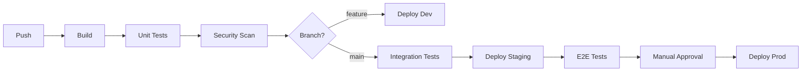

# Design Document: [Infrastructure / Cloud Architecture Name]

## Document Control

| Field | Value |
|-------|-------|
| Version | 1.0 |
| Status | Draft / In Review / Approved |
| Last Updated | YYYY-MM-DD |
| Author(s) | |
| Reviewers | |

---

## 1. Introduction

### 1.1 Purpose

Describe the purpose of this infrastructure design. Explain what applications or services this infrastructure supports, and what goals the infrastructure achieves (scalability, reliability, cost efficiency, etc.).

### 1.2 Scope

Define the boundaries of this infrastructure design. Clearly state what environments, regions, and services are included and what is explicitly excluded. Identify related infrastructure that is out of scope but may be affected.

### 1.3 Requirements Traceability

Map each requirement from the source requirements document to the sections in this design that address it.

| Requirement ID | Requirement Summary | Design Section |
|----------------|---------------------|----------------|
| REQ-XXX | | §X.X |

---

## 2. Infrastructure Context

### 2.1 Infrastructure Overview

Describe the overall infrastructure architecture. Explain the cloud provider(s) used, the high-level topology, and how this infrastructure supports the applications deployed on it.

### 2.2 Applications Supported

List the applications and services that will run on this infrastructure.

| Application | Type | Resource Requirements | Criticality |
|-------------|------|----------------------|-------------|
| | Web/API/Agent/Database | | High/Medium/Low |

### 2.3 Environment Strategy

Describe the environments that will be provisioned. Explain the purpose of each environment and how they differ.

| Environment | Purpose | Parity with Production | Access |
|-------------|---------|------------------------|--------|
| Development | | | |
| Staging | | | |
| Production | | | |

### 2.4 Cloud Provider Selection

Describe the cloud provider(s) selected and the rationale. Explain any multi-cloud or hybrid cloud considerations.

| Provider | Services Used | Rationale |
|----------|---------------|-----------|
| | | |

**Supporting Diagram (optional):** High-level infrastructure overview showing major components and their relationships.

---

## 3. Network Architecture

### 3.1 Network Topology

Describe the overall network design. Explain the network segmentation strategy, address allocation, and connectivity patterns.

### 3.2 Virtual Networks

Define the virtual networks (VPCs, VNets) in this architecture.

#### [Network Name]

**Purpose:** Describe what this network hosts and why it is separate.

**CIDR Block:** Specify the IP address range.

**Region:** Specify the region(s) where this network exists.

**Subnets:**

| Subnet | CIDR | Availability Zone | Purpose | Public/Private |
|--------|------|-------------------|---------|----------------|
| | | | | |

*(Repeat for each virtual network)*

### 3.3 Network Connectivity

Describe how networks connect to each other and to external networks.

#### VPC/VNet Peering

| Connection | From | To | Purpose |
|------------|------|-----|---------|
| | | | |

#### VPN Connections

| Connection | Type | Endpoints | Purpose |
|------------|------|-----------|---------|
| | Site-to-Site/Point-to-Site | | |

#### Direct Connect / Express Route

Describe dedicated connectivity to on-premises or other networks if applicable.

### 3.4 DNS Architecture

Describe the DNS design. Explain public and private DNS zones, resolution strategy, and domain management.

| Zone | Type | Purpose | Records Managed |
|------|------|---------|-----------------|
| | Public/Private | | |

### 3.5 Load Balancing

Describe the load balancing architecture.

#### [Load Balancer Name]

**Type:** Application/Network/Gateway

**Scope:** Public/Internal

**Targets:** Describe what receives traffic from this load balancer.

**Health Checks:** Describe health check configuration.

**Routing Rules:** Describe how traffic is routed.

*(Repeat for each load balancer)*

### 3.6 CDN and Edge

Describe content delivery and edge computing if applicable.

**CDN Provider:** Specify the CDN used.

**Origins:** Describe origin servers.

**Caching Strategy:** Describe what is cached and for how long.

**Edge Functions:** Describe edge compute functions if used.

### 3.7 Network Security

Describe network-level security controls.

#### Security Groups / Network ACLs

| Resource | Inbound Rules | Outbound Rules | Purpose |
|----------|---------------|----------------|---------|
| | | | |

#### Web Application Firewall

Describe WAF configuration if used. Explain rule sets and custom rules.

#### DDoS Protection

Describe DDoS protection measures.

**Supporting Diagram (optional):** Network topology diagram showing VPCs, subnets, and connectivity.

---

## 4. Compute Architecture

### 4.1 Compute Strategy

Describe the overall compute strategy. Explain the choice between VMs, containers, serverless, and the rationale.

| Workload | Compute Type | Rationale |
|----------|--------------|-----------|
| | VM/Container/Serverless/PaaS | |

### 4.2 Container Orchestration

Describe the container orchestration platform if containers are used.

**Platform:** Kubernetes/ECS/AKS/GKE/etc.

**Cluster Architecture:**

| Cluster | Environment | Node Pools | Purpose |
|---------|-------------|------------|---------|
| | | | |

**Node Configuration:**

| Node Pool | Instance Type | Min Nodes | Max Nodes | Purpose |
|-----------|---------------|-----------|-----------|---------|
| | | | | |

**Namespaces:**

| Namespace | Purpose | Resource Quotas |
|-----------|---------|-----------------|
| | | |

### 4.3 Virtual Machines

Describe VM-based compute if used.

#### [VM / Instance Group Name]

**Purpose:** Describe what runs on these VMs.

**Instance Type:** Specify the VM size/type.

**Operating System:** Specify the OS image.

**Scaling:** Describe auto-scaling configuration.

**Placement:** Describe availability zone distribution.

*(Repeat for each VM type)*

### 4.4 Serverless Compute

Describe serverless compute if used.

#### [Function / Lambda Name]

**Purpose:** Describe what this function does.

**Runtime:** Specify the runtime environment.

**Trigger:** Describe what invokes this function.

**Memory/Timeout:** Specify resource limits.

**Concurrency:** Describe concurrency limits.

*(Repeat for each function)*

### 4.5 Compute Sizing

Describe how compute resources are sized. Explain the methodology for determining resource requirements.

| Resource | Baseline | Peak | Sizing Rationale |
|----------|----------|------|------------------|
| | | | |

**Supporting Diagram (optional):** Compute architecture diagram showing clusters, node pools, and workload placement.

---

## 5. Storage Architecture

### 5.1 Storage Strategy

Describe the overall storage strategy. Explain the types of storage used and the rationale.

### 5.2 Object Storage

Describe object storage (S3, Blob Storage, GCS) if used.

#### [Bucket/Container Name]

**Purpose:** Describe what is stored.

**Access Pattern:** Describe read/write patterns.

**Storage Class:** Specify the storage tier.

**Lifecycle Policy:** Describe data lifecycle rules.

**Encryption:** Describe encryption configuration.

**Access Control:** Describe access permissions.

*(Repeat for each bucket)*

### 5.3 Block Storage

Describe block storage (EBS, Managed Disks) if used.

| Volume | Type | Size | IOPS | Attached To | Purpose |
|--------|------|------|------|-------------|---------|
| | SSD/HDD/Provisioned | | | | |

### 5.4 File Storage

Describe file storage (EFS, Azure Files, Filestore) if used.

| File System | Type | Size | Access | Purpose |
|-------------|------|------|--------|---------|
| | | | | |

### 5.5 Backup Strategy

Describe the backup strategy for storage resources.

| Resource | Backup Frequency | Retention | Recovery Point |
|----------|------------------|-----------|----------------|
| | | | |

---

## 6. Database Infrastructure

### 6.1 Database Strategy

Describe the overall database infrastructure strategy. Explain managed vs self-hosted decisions and the rationale.

### 6.2 Managed Database Services

Describe managed database services used.

#### [Database Name]

**Service:** RDS/Cloud SQL/CosmosDB/etc.

**Engine:** PostgreSQL/MySQL/MongoDB/etc.

**Instance Class:** Specify the instance size.

**Storage:** Describe storage configuration and auto-scaling.

**High Availability:** Describe HA configuration (multi-AZ, replicas).

**Backup:** Describe backup configuration.

**Networking:** Describe network placement and access.

*(Repeat for each database)*

### 6.3 Self-Hosted Databases

Describe self-hosted database infrastructure if applicable.

### 6.4 Caching Infrastructure

Describe caching infrastructure.

#### [Cache Name]

**Service:** ElastiCache/Memorystore/Azure Cache

**Engine:** Redis/Memcached

**Node Type:** Specify the instance size.

**Cluster Mode:** Describe clustering configuration.

**High Availability:** Describe replication and failover.

*(Repeat for each cache)*

---

## 7. Security Infrastructure

### 7.1 Identity and Access Management

Describe IAM architecture for cloud resources.

#### Service Accounts / IAM Roles

| Identity | Type | Permissions | Used By |
|----------|------|-------------|---------|
| | Service Account/Role | | |

#### IAM Policies

Describe key IAM policies and their purpose. Explain the principle of least privilege implementation.

### 7.2 Secrets Management

Describe secrets management infrastructure.

**Service:** AWS Secrets Manager/HashiCorp Vault/Azure Key Vault/etc.

**Secret Types:**

| Secret Type | Storage | Rotation | Access |
|-------------|---------|----------|--------|
| | | | |

### 7.3 Certificate Management

Describe certificate management.

**Certificate Authority:** Describe CA used (ACM, Let's Encrypt, etc.).

**Certificates:**

| Certificate | Domain(s) | Renewal | Used By |
|-------------|-----------|---------|---------|
| | | Auto/Manual | |

### 7.4 Encryption

Describe encryption infrastructure.

#### Encryption at Rest

| Resource | Encryption | Key Management |
|----------|------------|----------------|
| | | CMK/Provider-managed |

#### Encryption in Transit

Describe TLS configuration and certificate management.

### 7.5 Security Monitoring

Describe security monitoring infrastructure.

| Service | Purpose | Alerts |
|---------|---------|--------|
| | | |

---

## 8. Observability Infrastructure

### 8.1 Observability Strategy

Describe the overall observability strategy and platform selection.

**Platform Selection:**

| Platform | Use Case | Components |
|----------|----------|------------|
| CloudWatch | AWS-native | Logs, metrics, alarms |
| Datadog | Full-stack APM | Logs, metrics, traces, APM |
| Prometheus + Grafana | Open source | Metrics, visualization |
| Jaeger/Zipkin/X-Ray | Tracing | Distributed traces |

**Chosen Stack:**

| Component | Solution | Rationale |
|-----------|----------|-----------|
| Logging | | |
| Metrics | | |
| Tracing | | |
| Alerting | | |
| Dashboards | | |

### 8.2 Logging Architecture

Describe the logging infrastructure.

**Log Aggregation:** Describe the centralized logging solution.

**Log Format:** JSON structured logging with standard fields:

```json
{
  "timestamp": "ISO8601",
  "level": "INFO|WARN|ERROR",
  "service": "service-name",
  "trace_id": "correlation-id",
  "message": "Log message",
  "context": {}
}
```

**Log Levels Policy:**

| Level | Use Case | Retention |
|-------|----------|-----------|
| DEBUG | Development only | 1 day |
| INFO | Normal operations | 30 days |
| WARN | Potential issues | 90 days |
| ERROR | Failures | 1 year |

**Log Sources:**

| Source | Log Types | Retention | Storage | Purpose |
|--------|-----------|-----------|---------|---------|
| Application | Structured JSON | 30 days | CloudWatch/S3 | Debugging |
| Infrastructure | System logs | 90 days | CloudWatch | Operations |
| Security | Audit logs | 1 year | S3 (immutable) | Compliance |
| Access | Request logs | 90 days | S3 | Analytics |

**Log Processing:** Describe any log processing or transformation (e.g., log enrichment, filtering, aggregation).

### 8.3 Metrics Infrastructure

Describe the metrics collection infrastructure.

**Metrics Platform:** CloudWatch/Prometheus/Datadog/New Relic

**Metrics Categories:**

| Category | Examples | Collection Method |
|----------|----------|-------------------|
| Infrastructure | CPU, memory, disk, network | Agent/CloudWatch |
| Application | Request count, latency, errors | SDK/StatsD |
| Business | Transactions, revenue, users | Custom metrics |
| Custom | Domain-specific KPIs | Application code |

**Metrics Sources:**

| Source | Metrics Collected | Scrape Interval | Labels |
|--------|-------------------|-----------------|--------|
| EC2/ECS | CPU, memory, network | 60s | env, service |
| Application | HTTP metrics, custom | 30s | env, service, endpoint |
| Database | Connections, queries | 60s | env, database |
| Cache | Hit rate, memory | 30s | env, cluster |

### 8.4 Tracing Infrastructure

Describe distributed tracing infrastructure.

**Tracing Platform:** X-Ray/Jaeger/Zipkin/Datadog APM

**Trace Propagation:**

| Protocol | Header | Services |
|----------|--------|----------|
| W3C Trace Context | traceparent | All services |
| X-Ray | X-Amzn-Trace-Id | AWS services |

**Sampling Strategy:**

| Environment | Sampling Rate | Rationale |
|-------------|---------------|-----------|
| Development | 100% | Full visibility |
| Staging | 100% | Testing validation |
| Production | 10% | Cost/performance balance |

**Instrumentation:**

| Service Type | Instrumentation | Auto/Manual |
|--------------|-----------------|-------------|
| HTTP services | OpenTelemetry SDK | Auto |
| Database calls | Driver instrumentation | Auto |
| External APIs | Manual spans | Manual |

### 8.5 Key Performance Indicators (KPIs)

Define service-level indicators and objectives.

**Service Level Indicators (SLIs):**

| SLI | Definition | Target (SLO) | Alert Threshold |
|-----|------------|--------------|-----------------|
| Availability | Successful requests / total requests | 99.9% | < 99.5% |
| Latency P50 | 50th percentile response time | < 100ms | > 200ms |
| Latency P99 | 99th percentile response time | < 500ms | > 1000ms |
| Error Rate | 5xx responses / total responses | < 0.1% | > 1% |
| Throughput | Requests per second capacity | > 1000 RPS | < 500 RPS |

**Business KPIs:**

| KPI | Definition | Target | Alert Threshold |
|-----|------------|--------|-----------------|
| | | | |

### 8.6 Alerting Infrastructure

Describe alerting infrastructure.

**Alerting Platform:** CloudWatch Alarms/PagerDuty/Opsgenie/Datadog

**Alert Severity Levels:**

| Severity | Response Time | Examples | Notification |
|----------|---------------|----------|--------------|
| P1 - Critical | < 15 min | Service down, data loss | Page on-call |
| P2 - High | < 1 hour | Degraded performance | Page on-call |
| P3 - Medium | < 4 hours | Non-critical feature issue | Slack channel |
| P4 - Low | Next business day | Minor issues | Ticket |

**Alert Definitions:**

| Alert | Condition | Severity | Runbook |
|-------|-----------|----------|---------|
| High Error Rate | Error rate > 1% for 5 min | P2 | runbooks/high-errors.md |
| High Latency | P99 > 1s for 5 min | P2 | runbooks/high-latency.md |
| Service Down | Health check fails 3x | P1 | runbooks/service-down.md |
| High CPU | CPU > 80% for 10 min | P3 | runbooks/high-cpu.md |
| Database Connections | Connections > 80% pool | P2 | runbooks/db-connections.md |

**Notification Channels:**

| Channel | Type | Recipients | Use Case |
|---------|------|------------|----------|
| PagerDuty | Page | On-call engineer | P1, P2 alerts |
| Slack #ops | Message | Operations team | P3, P4 alerts |
| Email | Email | Stakeholders | Daily summary |

### 8.7 Dashboards

Describe dashboard infrastructure.

| Dashboard | Platform | Purpose | Audience | Refresh |
|-----------|----------|---------|----------|---------|
| Operations Overview | Grafana/Datadog | System health | Ops team | Real-time |
| Application Performance | Grafana/Datadog | Service metrics | Dev team | Real-time |
| Business Metrics | Grafana/Looker | KPIs | Leadership | Hourly |
| Security | CloudWatch/SIEM | Security events | Security team | Real-time |

**Dashboard Components:**

- **Operations Dashboard**: CPU, memory, disk, network, container health
- **Application Dashboard**: Request rate, latency histogram, error rate, throughput
- **Business Dashboard**: Active users, transactions, revenue metrics

### 8.8 On-Call and Escalation

Describe on-call procedures and escalation paths.

**On-Call Rotation:**

| Team | Rotation | Coverage | Primary Contact |
|------|----------|----------|-----------------|
| Platform | Weekly | 24/7 | PagerDuty |
| Application | Weekly | Business hours | Slack |

**Escalation Path:**

| Level | Responder | Escalation Trigger |
|-------|-----------|-------------------|
| L1 | On-call engineer | Alert fired |
| L2 | Team lead | No response in 15 min |
| L3 | Engineering manager | No resolution in 1 hour |
| L4 | VP Engineering | Major incident |

### 8.9 Runbook Integration

Describe runbook management and integration.

**Runbook Location:** `runbooks/` directory or wiki

**Runbook Template:**

```markdown
# [Alert Name] Runbook

## Overview
Brief description of the alert and its impact.

## Symptoms
- What the alert indicates
- Related symptoms to check

## Investigation Steps
1. Step 1
2. Step 2

## Resolution Steps
1. Step 1
2. Step 2

## Escalation
When and how to escalate.

## Prevention
How to prevent future occurrences.
```

**Required Runbooks:**

| Runbook | Alert | Owner |
|---------|-------|-------|
| service-down.md | Service Down | Platform team |
| high-errors.md | High Error Rate | Application team |
| high-latency.md | High Latency | Application team |
| db-connections.md | Database Issues | Platform team |
| high-cpu.md | High CPU | Platform team |

---

## 9. CI/CD Infrastructure

### 9.1 CI/CD Platform

Describe the CI/CD platform used. Explain the choice of platform and how it integrates with the infrastructure.

**Platform:** GitHub Actions/GitLab CI/Azure DevOps/Jenkins/CircleCI

**Platform Selection Rationale:**

| Criterion | Evaluation | Score |
|-----------|------------|-------|
| Integration with VCS | | |
| Self-hosted runner support | | |
| Secret management | | |
| Cost | | |

**Runners/Agents:**

| Runner Type | Location | Capacity | Purpose |
|-------------|----------|----------|---------|
| Cloud-hosted | Provider | | General builds |
| Self-hosted | VPC | | Security-sensitive |

### 9.2 Pipeline Architecture

Describe the overall pipeline architecture with a diagram.



### 9.3 Pipeline Stages

Define each pipeline stage in detail.

| Stage | Trigger | Duration Target | Failure Action |
|-------|---------|-----------------|----------------|
| Build | Push to any branch | < 5 min | Block pipeline |
| Unit Tests | After build | < 10 min | Block pipeline |
| Security Scan | After build | < 15 min | Block on critical |
| Integration Tests | Main/develop branch | < 20 min | Block deploy |
| E2E Tests | Before staging deploy | < 30 min | Block prod deploy |
| Deploy | Per environment config | < 10 min | Auto-rollback |

### 9.4 Artifact Management

Describe artifact storage and management.

| Artifact Type | Repository | Retention | Access | Cleanup Policy |
|---------------|------------|-----------|--------|----------------|
| Container Images | ECR/GCR/ACR | 90 days | Role-based | Delete untagged |
| Packages | npm/PyPI/Maven | Indefinite | Team | Manual |
| Build Artifacts | S3/GCS | 30 days | Pipeline | Auto-expire |

### 9.5 Deployment Pipeline

Describe the deployment pipeline infrastructure.

**Deployment Strategy:** Blue-Green/Rolling/Canary/GitOps

**Environment Promotion:**

| Environment | Deployment Trigger | Approval Required | Tests Run | Rollback Strategy |
|-------------|-------------------|-------------------|-----------|-------------------|
| Development | Push to feature/* | None | Unit, lint | Redeploy previous |
| Staging | Push to main | None | All tests | Redeploy previous |
| Production | Manual trigger | Required | Smoke tests | Blue-green switch |

### 9.6 Rollback Procedures

Define rollback procedures for each environment.

| Environment | Rollback Trigger | Procedure | RTO |
|-------------|------------------|-----------|-----|
| Development | Manual | Redeploy previous commit | < 5 min |
| Staging | Test failure | Auto-redeploy previous | < 10 min |
| Production | Health check fail | Switch to blue/green | < 5 min |

### 9.7 Secret Injection

Describe how secrets are injected into pipelines.

| Secret Type | Storage | Injection Method | Rotation |
|-------------|---------|------------------|----------|
| API Keys | Secrets Manager | Environment variable | 90 days |
| Database Credentials | Vault | Sidecar/init | 30 days |
| Cloud Credentials | IAM Role | OIDC federation | N/A |

**Security Requirements:**
- Secrets never logged or exposed in pipeline output
- Secrets masked in logs
- Secrets not passed between stages in plaintext

### 9.8 Caching Strategy

Describe caching to optimize pipeline performance.

| Cache Type | Storage | TTL | Invalidation |
|------------|---------|-----|--------------|
| Dependencies | S3/GCS | 7 days | lockfile change |
| Build cache | Local/remote | 1 day | Code change |
| Docker layers | Registry | 30 days | Base image update |

### 9.9 Infrastructure as Code

Describe the IaC approach.

**IaC Tool:** Terraform/CloudFormation/Pulumi/CDK

**State Management:**

| State Store | Backend | Locking | Encryption |
|-------------|---------|---------|------------|
| Terraform state | S3 + DynamoDB | Yes | AES-256 |

**Module Structure:**

```
infrastructure/
├── modules/
│   ├── networking/
│   ├── compute/
│   ├── database/
│   └── monitoring/
├── environments/
│   ├── dev/
│   ├── staging/
│   └── prod/
└── shared/
```

**IaC Pipeline:**

| Action | Trigger | Approval |
|--------|---------|----------|
| Plan | PR opened | None |
| Apply (non-prod) | PR merged | None |
| Apply (prod) | Manual | Required |

---

## 10. Disaster Recovery

### 10.1 DR Strategy

Describe the disaster recovery strategy. Explain RPO and RTO targets and the approach to achieving them.

| Tier | Applications | RPO | RTO | DR Strategy |
|------|--------------|-----|-----|-------------|
| | | | | Active-Active/Active-Passive/Backup-Restore |

### 10.2 Backup Infrastructure

Describe backup infrastructure for disaster recovery.

| Resource | Backup Method | Frequency | Retention | DR Location |
|----------|---------------|-----------|-----------|-------------|
| | | | | |

### 10.3 Replication

Describe data replication for disaster recovery.

| Resource | Replication Type | Target Region | Lag |
|----------|------------------|---------------|-----|
| | Sync/Async | | |

### 10.4 Failover Procedures

Describe failover procedures at a high level. Reference runbooks for detailed procedures.

| Scenario | Failover Type | Automation | Estimated Time |
|----------|---------------|------------|----------------|
| | Automatic/Manual | | |

### 10.5 DR Testing

Describe DR testing strategy.

| Test Type | Frequency | Scope | Last Tested |
|-----------|-----------|-------|-------------|
| | | | |

---

## 11. Cost Management

### 11.1 Cost Optimization Strategy

Describe the approach to cost optimization. Explain reserved capacity, spot instances, and right-sizing strategies.

### 11.2 Cost Allocation

Describe how costs are allocated and tracked.

**Tagging Strategy:**

| Tag | Purpose | Required |
|-----|---------|----------|
| | | Yes/No |

**Cost Centers:**

| Cost Center | Resources | Budget |
|-------------|-----------|--------|
| | | |

### 11.3 Cost Estimates

Provide cost estimates for the infrastructure.

| Component | Monthly Estimate | Notes |
|-----------|------------------|-------|
| Compute | | |
| Storage | | |
| Database | | |
| Network | | |
| Other | | |
| **Total** | | |

### 11.4 Cost Monitoring

Describe cost monitoring and alerting.

| Alert | Threshold | Action |
|-------|-----------|--------|
| | | |

---

## 12. Compliance and Governance

### 12.1 Compliance Requirements

List compliance requirements that affect infrastructure design.

| Requirement | Standard | Impact on Infrastructure |
|-------------|----------|-------------------------|
| | SOC2/HIPAA/PCI/GDPR/etc. | |

### 12.2 Data Residency

Describe data residency requirements and how they are met.

| Data Type | Residency Requirement | Implementation |
|-----------|----------------------|----------------|
| | | |

### 12.3 Governance Controls

Describe governance controls implemented.

| Control | Implementation | Enforcement |
|---------|----------------|-------------|
| | | |

### 12.4 Audit Logging

Describe audit logging for compliance.

| Log Type | Source | Retention | Purpose |
|----------|--------|-----------|---------|
| | | | |

---

## 13. Operations

### 13.1 Operational Model

Describe the operational model. Explain who operates this infrastructure and how responsibilities are divided.

### 13.2 Access Management

Describe how operators access the infrastructure.

| Access Type | Method | Authorization | Audit |
|-------------|--------|---------------|-------|
| | | | |

### 13.3 Change Management

Describe the change management process for infrastructure changes.

### 13.4 Incident Response

Describe incident response procedures at a high level. Reference runbooks for detailed procedures.

### 13.5 Maintenance Windows

Describe planned maintenance windows and procedures.

| Maintenance Type | Frequency | Window | Impact |
|------------------|-----------|--------|--------|
| | | | |

---

## 14. Scalability Design

### 14.1 Scaling Strategy

Describe the overall scaling strategy. Explain how the infrastructure scales to meet demand.

### 14.2 Auto-Scaling Configuration

Describe auto-scaling configuration for compute resources.

| Resource | Metric | Scale Out | Scale In | Limits |
|----------|--------|-----------|----------|--------|
| | | | | |

### 14.3 Capacity Planning

Describe capacity planning approach. Explain how capacity needs are forecasted and provisioned.

| Resource | Current Capacity | Projected Growth | Planning Horizon |
|----------|------------------|------------------|------------------|
| | | | |

---

## 15. Constraints and Assumptions

### 15.1 Technical Constraints

List technical constraints that influenced this design.

| Constraint | Source | Impact on Design |
|------------|--------|------------------|
| | | |

### 15.2 Assumptions

List assumptions made during this design.

| Assumption | Rationale | Risk if Invalid |
|------------|-----------|-----------------|
| | | |

---

## 16. Risks and Open Questions

### 16.1 Design Risks

Identify risks associated with this design.

| Risk | Likelihood | Impact | Mitigation |
|------|------------|--------|------------|
| | | | |

### 16.2 Open Questions

List unresolved questions that need answers.

| Question | Owner | Target Resolution Date |
|----------|-------|------------------------|
| | | |

---

## 17. Glossary

Define terms, acronyms, and concepts used in this document.

| Term | Definition |
|------|------------|
| | |

---

## Appendix A: Supporting Diagrams

Include infrastructure diagrams referenced throughout the document.

### A.1 [Diagram Title]

**Purpose:** Describe what this diagram illustrates.

*[Diagram]*

---

## Appendix B: Resource Inventory

### B.1 Complete Resource List

| Resource | Type | Environment | Region | Configuration |
|----------|------|-------------|--------|---------------|
| | | | | |

---

## Appendix C: Reference Documents

| Document | Version | Relevance |
|----------|---------|-----------|
| | | |
