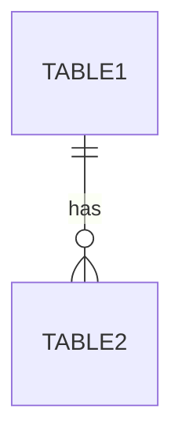

# {Source} Schema
Version: 1

## Tables/Collections

### {TableName}

| Column | Type | Constraints | Description |
|--------|------|-------------|-------------|
| id | UUID | PK | Primary identifier |
| created_at | TIMESTAMP | NOT NULL, DEFAULT NOW() | Creation timestamp |
| updated_at | TIMESTAMP | NOT NULL, DEFAULT NOW() | Last update timestamp |

### Indexes

| Name | Columns | Type | Purpose |
|------|---------|------|---------|
| idx_{table}_{column} | {column} | BTREE | {Why needed} |

### Constraints

| Name | Type | Definition |
|------|------|------------|
| fk_{table}_{ref} | FOREIGN KEY | REFERENCES {ref_table}(id) |

## Relationships



## Migrations

### v1 → v2
- {Change description}
- Migration command:
```sql
-- Up
ALTER TABLE ...

-- Down
ALTER TABLE ...
```

---

## Data Dictionary

### {TableName}.{ColumnName}

- **Type**: {SQL type}
- **Constraints**: {PK, FK, NOT NULL, UNIQUE, etc.}
- **Description**: {What this field represents}
- **Valid Values**: {Enum values, ranges, or patterns}
- **Example**: `{example value}`
- **Notes**: {Any special handling}
